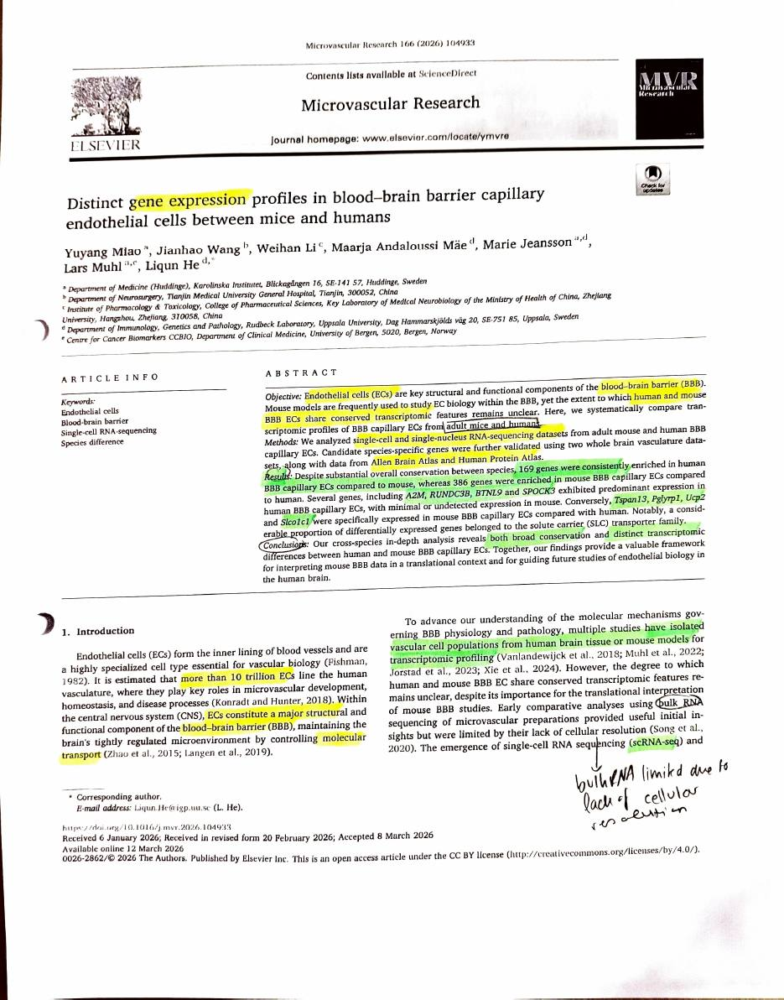
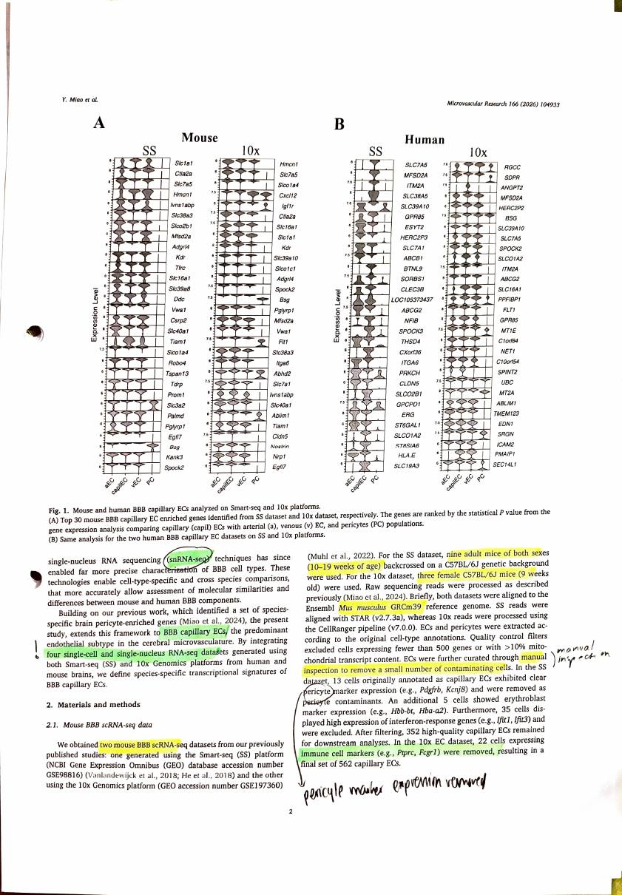
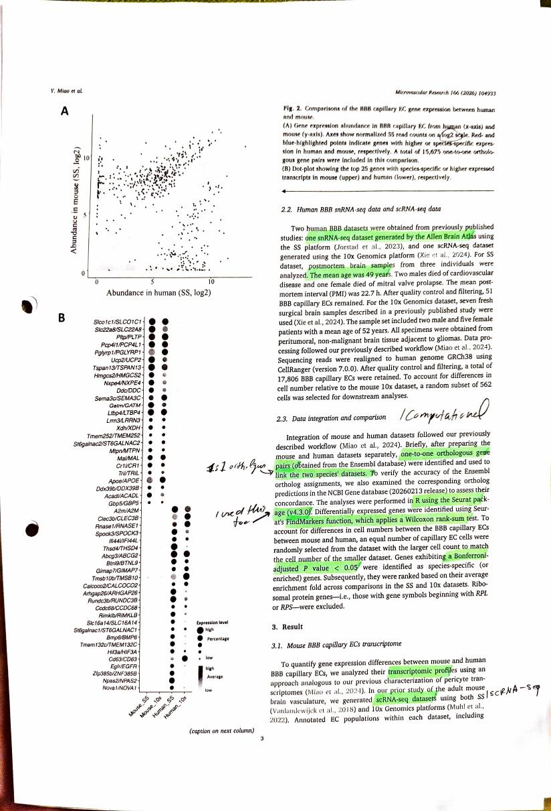
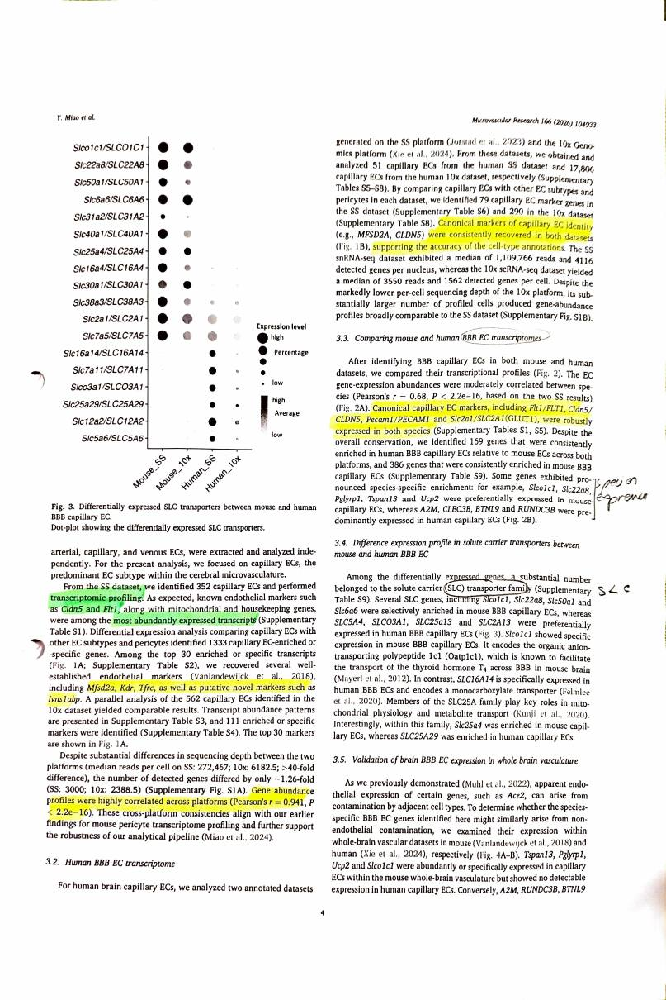
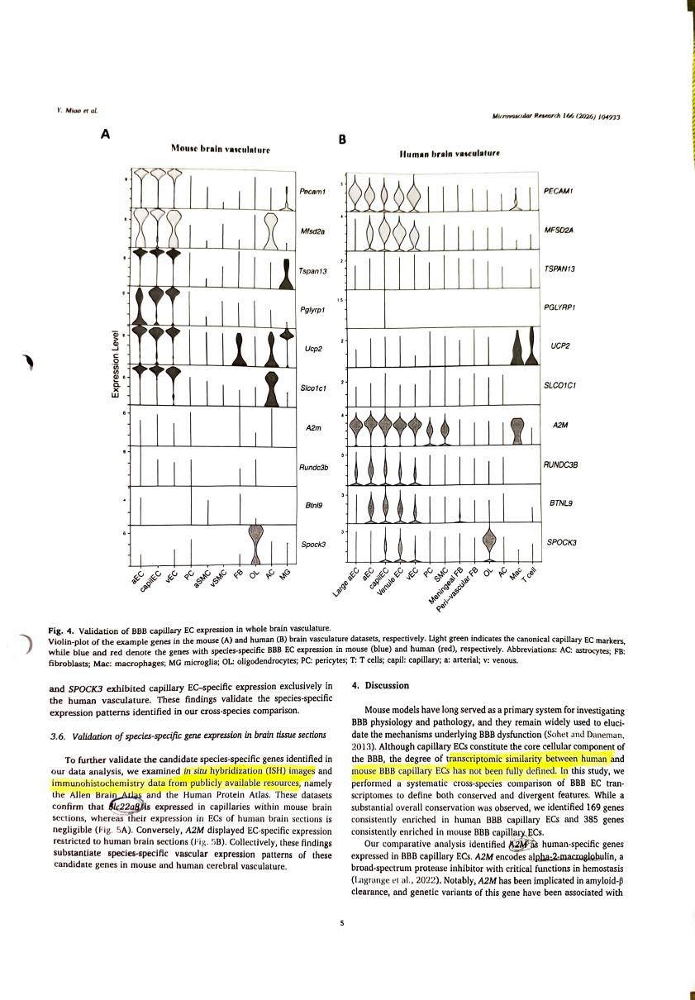
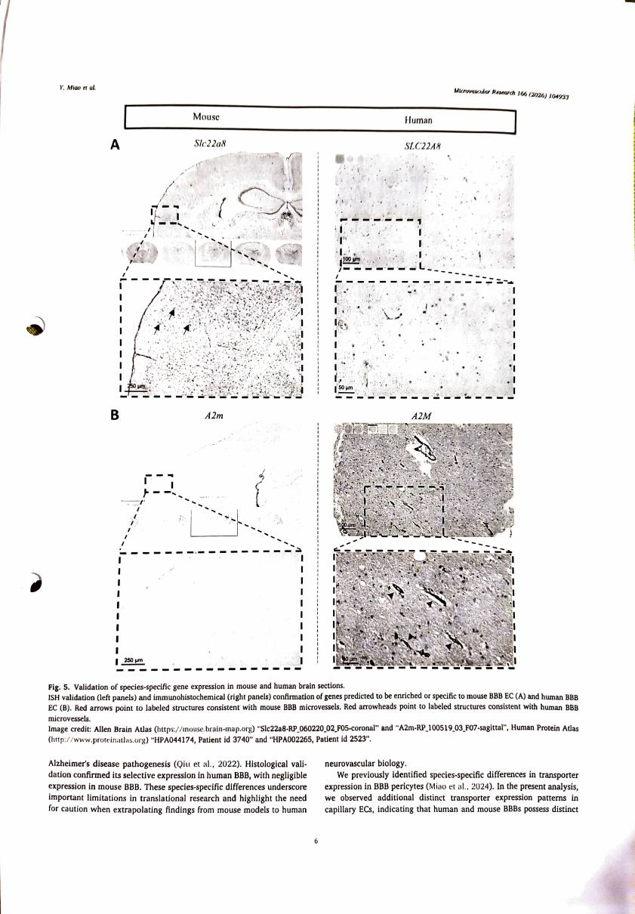
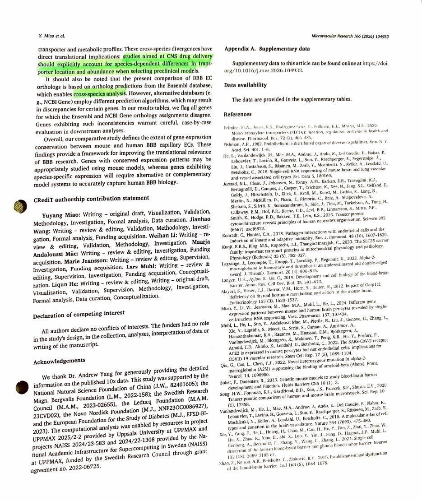

> Miao Y, Wang J, Li W, Mäe MA, Jeansson M, Muhl L, He L (2026). Distinct gene expression
> profiles in blood-brain barrier capillary endothelial cells between mice and humans.
> *Microvascular Research* 166:104933. <https://doi.org/10.1016/j.mvr.2026.104933>.
> Open access under CC BY 4.0.

| Field | |
|---|---|
| **Year** | 2026. Received 6 January, accepted 8 March, online 12 March 2026 |
| **Models** | **Mouse and human**, adult, compared directly. Four datasets across two platforms: mouse Smart-seq and 10x from the authors' own earlier work, human Allen Brain Atlas snRNA-seq and a 10x scRNA-seq dataset |
| **Brain region** | Not the focus, and the human tissue is mixed. Human Smart-seq is **post-mortem** brain from three individuals, mean PMI 22.7 h; human 10x is **fresh surgical peritumoral tissue adjacent to gliomas**. Mouse is whole brain vasculature |
| **Measures** | **RNA.** Single-cell and single-nucleus transcriptomes, restricted to **capillary** endothelial cells specifically |
| **Method** | scRNA-seq and snRNA-seq on Smart-seq and 10x. Validated against in situ hybridisation and immunohistochemistry from the Allen Brain Atlas and the Human Protein Atlas |
| **Cross-species stats** | **One-to-one orthologous gene pairs only**, from Ensembl, cross-checked against NCBI Gene. 15,675 pairs. Seurat `FindMarkers` with **Wilcoxon rank-sum**, **Bonferroni-adjusted** *P* < 0.05. Cell numbers downsampled so the two species are matched. Ribosomal genes excluded |

: {tbl-colwidths="[22,78]"}

## My reading

This was a very fitting paper. At the very beginning they just talk about what they are doing,
and their objective was to compare the transcriptomic profile of **blood brain barrier
capillary endothelial cells** between adult mice and humans.

What they found is that **169 genes were consistently enriched in human** BBB capillary
endothelial cells compared to mouse, whereas **386 genes were enriched in mouse** compared to
human. They have some species specific genes that were expressed in just one or the other.

What they conclude is that there is **broad conservation**, but that the distinct
transcriptomic differences between human and mouse BBB capillary endothelial cells need to be
taken seriously. At the very end they also talk about how this is applicable to the **drug
development** process.

**Introduction.** First they introduce the function of endothelial cells, and how other people
have tried to understand the transcriptomic profile. Turns out that **bulk RNA is limited due
to the lack of cellular resolution**. I am not quite sure exactly what they mean here, but
maybe it is the missing data. Only with the emergence of **single cell RNA sequencing** and
**single nucleus RNA sequencing** have they been able to do a much more precise
characterisation of barrier cell types.

**Materials and methods.** Specifically I had to look out for what method they were using: are
they referring to single nucleus RNA sequencing or single cell RNA sequencing. These were
things I needed to watch for.

They also talk about their **manual inspection** to remove a small number of contaminating
cells. They removed cells with **pericyte marker expression**, and also **immune cell
markers**.

Then they looked at the human snRNA-seq and scRNA-seq data. They talk about their patient age
and so on.

**Data integration and comparison** is pretty solid, because we did something similar. They
used **one-to-one orthologous gene pairs**. They used **R with the Seurat package**, which we
also used. Then they applied the **Wilcoxon rank-sum test**, which we also used, and a
**Bonferroni adjusted p-value**, which we also used.

**Results.** They again talk about having analysed the transcriptomic profile of mouse and
human. It turns out that specifically the markers **CLDN5 and FLT1** were the most abundantly
expressed transcripts. They also look at novel markers such as **MFSD2A, KDR and TFRC**, and
they find the gene abundance profiles were highly correlated across platforms.

Then they look at the human BBB endothelial transcriptome again, and check that the canonical
markers of capillary endothelial cells were consistently recovered in both datasets, which
makes their case pretty strong.

Then they looked at the mouse and human BBB endothelial transcriptomes together. They checked
the markers, saw that both were expressed in both datasets, and that is when they showed the
**species specific enrichment**.

Then they point out that the **SLC transporter family** was specifically expressed, in that a
substantial number of the differentially expressed genes belong to this family.

Then they talk about the **validation**, which they did using **ISH images and
immunohistochemistry**.

**Discussion.** They discuss that the transcriptomic profile has some similarities but is not
fully defined, and that when you do drug development you need to watch out specifically for
the different enriched genes in the BBB capillary endothelial cell profile between mouse and
human.

## What I take from it

They used the same comparison machinery we did: one-to-one orthologues, Seurat, Wilcoxon,
Bonferroni. Seeing our own choices turn up in a 2026 paper in the field is reassuring about
the statistics, whatever else is wrong upstream.

## Checks against the paper

- **On bulk RNA and cellular resolution.** Bulk RNA-seq grinds up the whole tissue and measures
  the average across every cell in it. Brain tissue is overwhelmingly neurons and glia, so the
  endothelial signal is a small fraction of the total and cannot be separated out. It is not
  missing data so much as **blended** data. Single cell and single nucleus methods measure one
  cell at a time, so capillary endothelial cells can be picked out and compared directly. This
  is the same problem noted for Wälchli in [Kumabe](kumabe2025.qmd).
- **Both methods are used, on both species.** Mouse is scRNA-seq on two platforms. Human is one
  **snRNA-seq** dataset (Allen Brain Atlas, Smart-seq) and one **scRNA-seq** dataset (10x).
- **The human tissue is worth noting.** The post-mortem dataset is three individuals, mean age
  49, mean post-mortem interval 22.7 h, yielding only **51** capillary endothelial cells. The
  surgical dataset is **peritumoral tissue adjacent to gliomas** from seven patients. Neither is
  healthy brain in the way the mouse tissue is, which is a real limit on the comparison and one
  the paper does not dwell on.
- **A small internal inconsistency.** The abstract and results say **386** genes enriched in
  mouse; the discussion says **385**. Worth knowing which to quote.
- **The numbers behind the claim.** Cross-platform correlation within mouse was Pearson
  *r* = 0.941. Between species the correlation was *r* = 0.68. 15,675 one-to-one orthologous
  pairs went into the comparison.

## The species-specific genes it names

**Higher or specific in mouse:** `Slco1c1`, `Slc22a8`, `Pglyrp1`, `Tspan13`, `Ucp2`.
`Slco1c1` encodes Oatp1c1, which carries thyroid hormone T4 across the mouse barrier.

**Higher or specific in human:** `A2M`, `CLEC3B`, `BTNL9`, `SPOCK3`, `RUNDC3B`. `A2M` is
alpha-2-macroglobulin, a protease inhibitor implicated in amyloid-beta clearance.

**Conserved and robust in both:** `FLT1`, `CLDN5`, `PECAM1`, `SLC2A1` (GLUT1), with `MFSD2A`
and `CLDN5` consistently recovered as canonical capillary markers.

## How it relates to this project

1. **This is the closest paper yet to what the project is doing, and it is two months old.**
   Same two species, same question of how far mouse stands in for human at the barrier, and
   published while this project was running. The difference is the measurement: they compare
   **expression**, this project compares **coding sequence**. That is a real distinction and it
   is worth stating in the project's framing rather than discovering later.

2. **It validates the statistical choices.** One-to-one orthologues, Seurat, Wilcoxon
   rank-sum, Bonferroni adjustment. That is the same framework as `step5e` and `step5g`. The
   [audit](../audit.qmd) already found the statistics to be the clean part of the pipeline;
   this is independent confirmation that they match current practice in the field.

3. **It settles the one-to-many orthologue question.** They restricted to **one-to-one
   orthologous pairs only**, 15,675 of them, and cross-checked Ensembl against NCBI. This
   project admitted 196 one-to-many pairs at 25.8% identity into the BBB set in `step3b`, and
   then `step5d` excluded them from the control but not from the BBB set. The field standard is
   to use one-to-one throughout. That is direct support for the `step5d` fix.

4. **The sharpest finding for this project: the divergent family is the SLC family.** A
   substantial proportion of the differentially expressed genes are solute carriers. This
   project's gene list carries 52 SLC genes, about 3.4% of it, including the ones named here,
   and it is measuring how conserved their *sequence* is. Miao shows that this is exactly the family whose *expression* diverges most
   between mouse and human. So the two measurements may well disagree, with a gene conserved in
   sequence and expressed quite differently. That is not a problem with either study. It is the
   most interesting thing either could say, and it is a result this project is positioned to
   contribute to.

5. **CLDN5 for the fourth time.** Here it is one of the two most abundantly expressed
   transcripts in mouse BBB capillary endothelial cells, and a canonical marker robustly
   expressed in both species. It is still absent from this project's gene list because it
   failed an enrichment cutoff. Four independent papers now treat it as central. This needs
   writing into the [limitations](../results.qmd).

6. **It gives a ready-made comparison set.** The 169 human-enriched and 386 mouse-enriched
   genes are a published, thresholded list of where the two species differ at the barrier. Once
   this project's conservation scores are corrected, asking whether those divergent genes are
   also less conserved in sequence is a direct, cheap and genuinely novel question.

## Annotated scan

::: {.scan-note}
My own printed and annotated pages, scanned back in.
:::

```{=html}
<div class="scan-gallery">
  <figure>
    
    <figcaption>Page 1</figcaption>
  </figure>
  <figure>
    
    <figcaption>Page 2</figcaption>
  </figure>
  <figure>
    
    <figcaption>Page 3</figcaption>
  </figure>
  <figure>
    
    <figcaption>Page 4</figcaption>
  </figure>
  <figure>
    
    <figcaption>Page 5</figcaption>
  </figure>
  <figure>
    
    <figcaption>Page 6</figcaption>
  </figure>
  <figure>
    
    <figcaption>Page 7</figcaption>
  </figure>
</div>
```

::: {.scan-note}
Pages reproduced from Miao et al. 2026, *Microvascular Research* 166:104933,
open access under CC BY 4.0. Handwriting and highlighting are mine.
[Original paper](https://doi.org/10.1016/j.mvr.2026.104933).
:::
