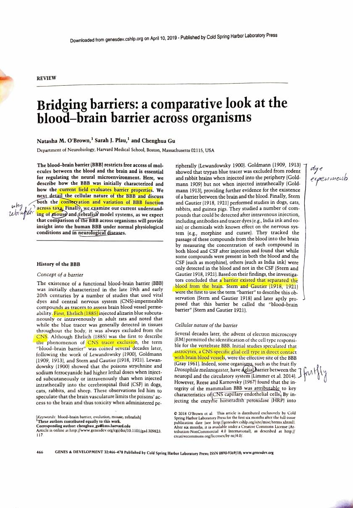
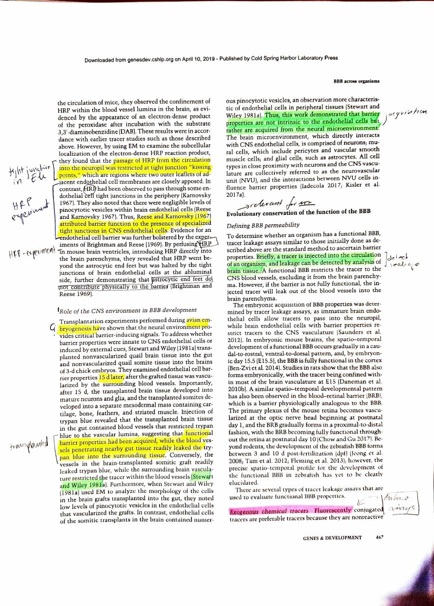
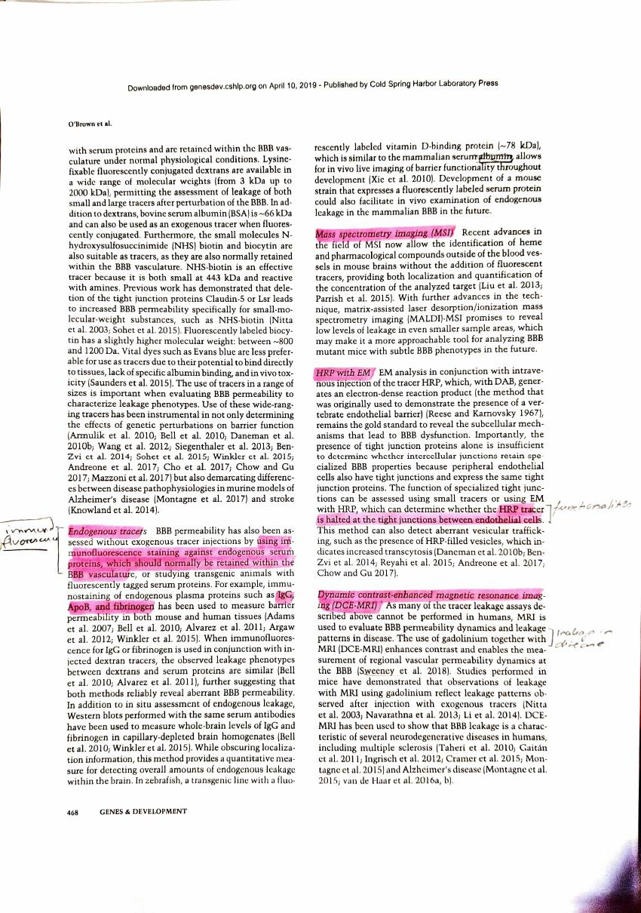
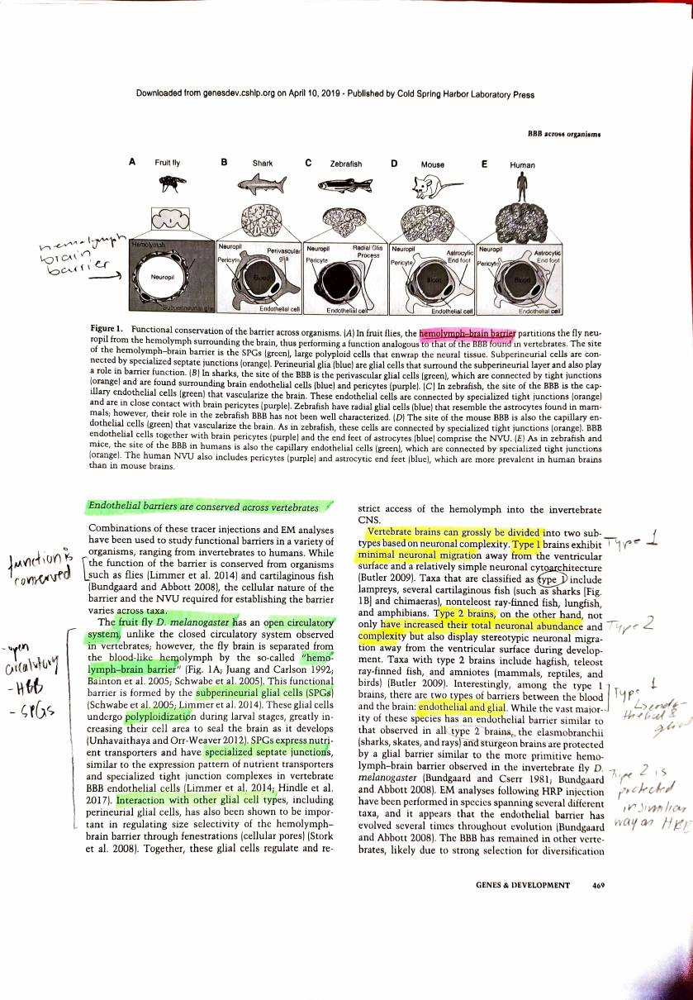
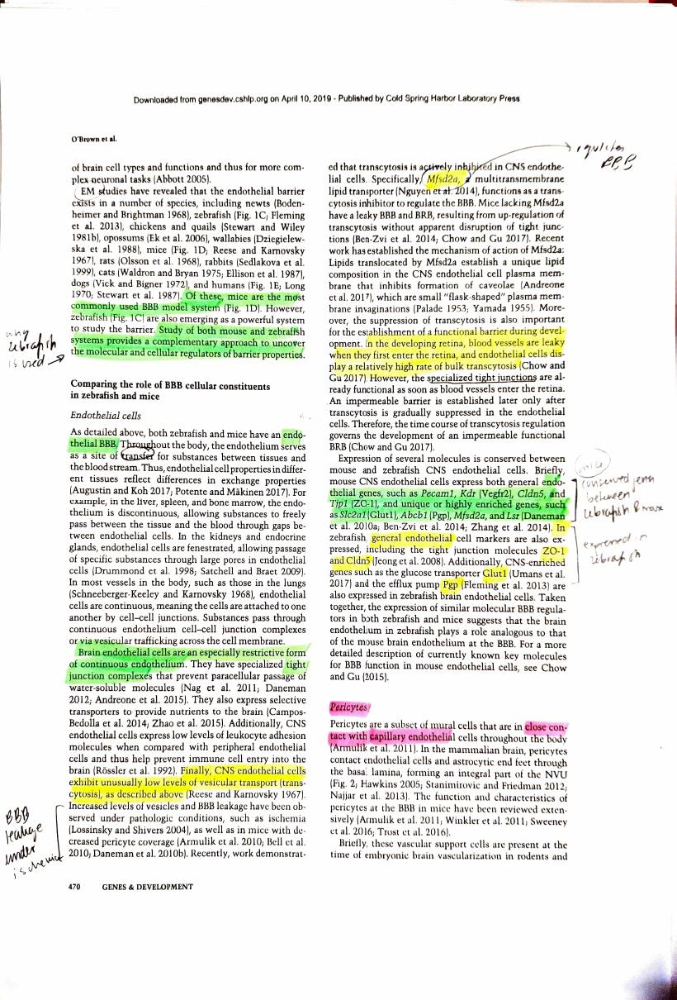
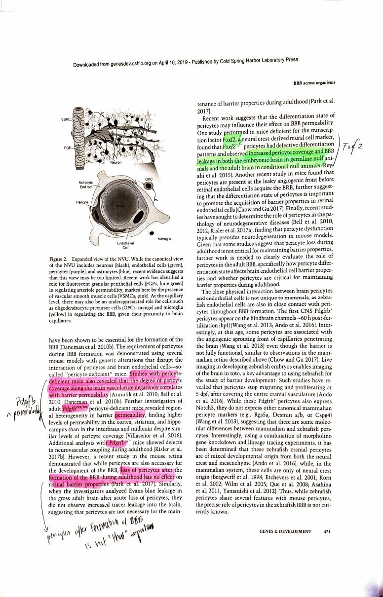
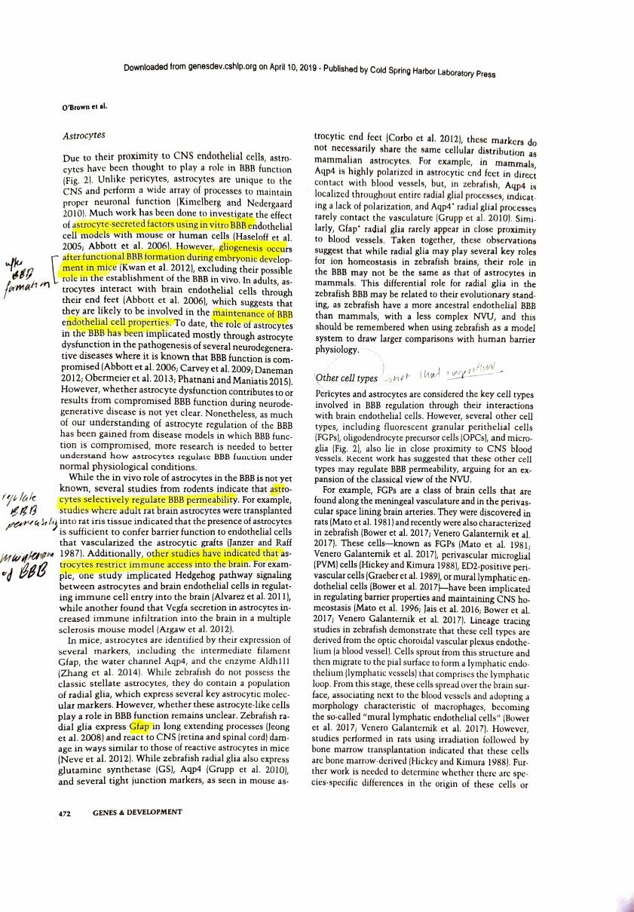
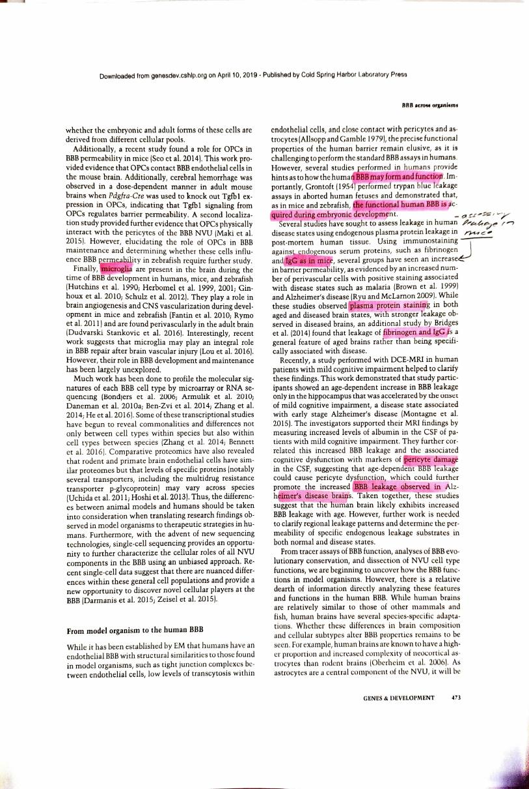
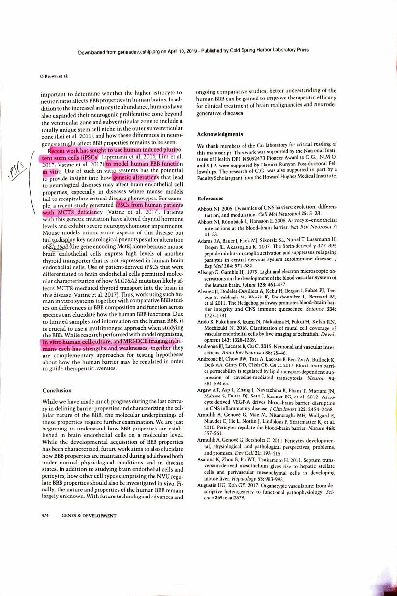

> O'Brown NM, Pfau SJ, Gu C (2018). Bridging barriers: a comparative look at the blood-brain
> barrier across organisms. *Genes & Development* 32:466-478.
> <https://doi.org/10.1101/gad.309823.117>. Open access under CC BY-NC 4.0.

| Field | |
|---|---|
| **Year** | 2018 |
| **Models** | A comparative review rather than new data. Covers fruit fly, shark, zebrafish, mouse and human, with **zebrafish and mouse compared in detail**. Human evidence is post-mortem tissue, DCE-MRI and iPSC models |
| **Brain region** | Not organised by region, but it reports **regional heterogeneity in barrier permeability**: in pericyte-deficient mice, cortex, striatum and hippocampus leak more than interbrain and midbrain, despite similar pericyte coverage |
| **Measures** | None of its own. It synthesises tracer permeability, electron microscopy, transcriptomics and comparative proteomics |
| **Method** | Narrative review. The methods it surveys are the tracer leakage assays: exogenous fluorescent tracers, endogenous serum protein staining, mass spectrometry imaging, HRP with EM, and DCE-MRI in humans |
| **Cross-species stats** | **None.** All cross-species comparison is narrative and qualitative. No orthologue assignment, no tests, no sequence |

: {tbl-colwidths="[22,78]"}

## My reading

This is a systematic review. They are essentially showing the current field of the blood brain
barrier and neurology, how they examine different barrier properties, different cellular
natures and different cells, and at the very end they discuss human induced pluripotent stem
cell applications specifically for understanding the blood brain barrier. They look at
**mouse and zebrafish** in more detail.

**History.** They start with the history of the blood brain barrier, specifically the
experiment of **Ehrlich**, who dyed an animal blue and found that the brain was not dyed blue.
With the other founding fathers of the field they figured out that there must be a barrier
constricting what goes in and what goes out.

**Cellular nature of the barrier.** They introduce a few cell types, starting with astrocytes,
and do so with the example of the fruit fly. They explain **HRP**, and how HRP passing from
the circulation into the **neuropil** was restricted at tight junctions, which shows the tight
junction. Then they look at how HRP passes through the barrier.

**The role of the CNS environment in barrier development.** The most important thing here is
that functional barrier properties are **acquired** during embryonic stages. To quote them:

> Thus, this work demonstrated that barrier properties are not intrinsic to the endothelial
> cells but rather are acquired from the neural microenvironment.

**Evolutionary conservation of barrier function.** This is the part that is interesting for
us. They look at mice and zebrafish, and they talk about conserved genes in mouse and human.

First they explain that the barrier can leak, and that it is important to understand where the
leakage is happening and to document it, because this is vital for disease understanding. To
quote them again:

> The embryonic acquisition of blood-brain barrier properties was determined by tracer leakage
> assays, as immature brain endothelial cells allow tracers to pass into the neuropil while
> brain endothelial cells with barrier properties restrict tracers to the CNS vasculature.

So that is how they run the experiments. Then they go into how to trace these leakage assays:

- **Exogenous chemical tracers**, with fluorescence
- **Endogenous tracers**, using immunofluorescence staining against endogenous serum proteins
  that should normally be retained within the barrier vasculature
- **Mass spectrometry imaging (MSI)**
- **HRP with EM**, since HRP tracers should be halted at tight junctions between endothelial
  cells
- **Dynamic contrast-enhanced magnetic resonance imaging (DCE-MRI)**

**Endothelial barriers are conserved across vertebrates.** The function is conserved, so the
primary function is always to shield the brain from unrestricted flows in and out.

The fruit fly has an **open circulatory system**, so it has a **hemolymph-brain barrier**, and
its **SPGs** work as the tight junctions from what I understand.

Vertebrate brains are divided into **type 1** and **type 2**. Type 1 is a relatively simple
neural structure, type 2 is more complex. Type 1 brains have two types of barrier between
blood and brain, **endothelial and glial**. Type 2 brains are similarly protected in the way
of the fruit fly with the hemolymph-brain barrier.

**Zebrafish and mice compared.** They compare the role of the barrier's cellular constituents
in zebrafish and mice, and note some genes which are essential and conserved in each.

**Pericytes.** After formation of the blood brain barrier, pericytes do not seem to be
important.

**Astrocytes.** Astrocytes also form after barrier formation, and they are for the maintenance
of the barrier. They also regulate how the permeability of the barrier functions.

They talk about other cell types which I did not think were that important.

**From model organism to human.** They note ways to assess leakage in human disease,
specifically using endogenous plasma protein leakage in post-mortem human tissue. They mention
**pericyte damage** and how that might be related to the barrier leakage observed in
Alzheimer's disease brains.

**iPSCs.** What they say next is quite interesting to my interest: recent work introducing
**human induced pluripotent stem cells** into the work of creating a blood brain barrier. This
step might help understand diseases better.

## What I take from it

It shows that there is actually a landscape of papers that look specifically at mouse and
human and then another species, which in this case was zebrafish.

It is also nice to see the connection between human induced pluripotent stem cells and the
blood brain barrier, in terms of creating models. And it was good to understand a bit about
the history of the barrier.

## Checks against the paper

- **Ehrlich was 1885, not 1855**, and he injected **alizarin blue into rats**, not a mouse.
  The term "blood-brain barrier" was not coined until Stern and Gautier, 1918 and 1921.
- **Pericytes and astrocytes are the other way round on formation and maintenance**, and the
  distinction is worth keeping straight:
  - **Pericytes are essential for barrier *formation*** in the embryo. What the review says is
    that they appear **not to be required for *maintenance***: after the barrier has formed,
    acute pericyte loss in adults did not increase tracer leakage.
  - **Astrocytes are the opposite.** Gliogenesis happens *after* the barrier forms, which rules
    them out of establishing it, but in adults they are likely involved in **maintenance**, and
    they selectively regulate permeability.
- **Astrocytic end feet do not physically form the barrier.** Brightman and Reese showed HRP
  went past the end feet and was halted at the endothelial tight junctions on the abluminal
  side.
- **The zebrafish question is answered in the review.** Mice are the most commonly used model;
  zebrafish are emerging as a complementary one because developing embryos are transparent, so
  the whole brain vasculature can be imaged live and in toto. The review also flags the
  caveat: zebrafish lack classic astrocytes, having radial glia instead, and have a less
  complex neurovascular unit, so it is a **more ancestral** endothelial barrier and that should
  be remembered when drawing comparisons to human.
- **Type 2 brains are not fly-like.** Type 2 brains (teleost fish, and amniotes including
  mammals, reptiles and birds) have the **endothelial** barrier. It is some **type 1** taxa,
  such as sharks, skates, rays and sturgeon, that are protected by a **glial** barrier
  resembling the fly's arrangement.

## The conserved genes it names

This is the most directly useful thing in the paper for this project, and it is worth pulling
out because these are cross-species conservation claims made at the level of expression.

**Mouse CNS endothelial cells express:**

- general endothelial genes: `Pecam1`, `Kdr` (Vegfr2), `Cldn5`, `Tjp1` (ZO-1)
- unique or highly enriched genes: `Slc2a1` (Glut1), `Abcb1` (P-gp), `Mfsd2a`, `Lsr`

**Zebrafish brain endothelium also expresses** ZO-1 and Cldn5, the glucose transporter Glut1,
the efflux pump P-gp, and mfsd2a. The review concludes that the expression of similar
molecular barrier regulators in both suggests the zebrafish brain endothelium plays a role
analogous to that of the mouse.

`MFSD2A` and `SLC2A1` are both on this project's gene list. `CLDN5` is not.

## How it relates to this project

1. **It is the closest thing so far to what this project is trying to do**, reached
   qualitatively rather than quantitatively. It makes exactly the claim the pipeline is trying
   to test with sequence, that barrier machinery is conserved across species, but it makes it
   from expression and function and without any statistics. That is both a validation of the
   question and an argument that the project's contribution is the **measurement**, not the
   claim.

2. **It answers the regional question with a citation.** The leaky barrier thread from the
   [Scientific American reading](../reading/sciam-healthy-brain-2026.qmd) asked whether the
   healthy barrier is uniformly tight. This review reports **regional heterogeneity in barrier
   permeability in mice**, with cortex, striatum and hippocampus leaking more than interbrain and
   midbrain, at similar pericyte coverage. So the barrier is not uniform, and a gene list built
   from a bulk microvessel fraction is averaging regions that differ. That is a real limit on
   [step 1](../audit.qmd) and it now has a source.

3. **It undercuts the premise more sharply than Park does.** "Barrier properties are not
   intrinsic to the endothelial cells but rather are acquired from the neural
   microenvironment." If barrier identity is **induced** by surrounding tissue rather than
   encoded in the endothelial cell, then coding-sequence conservation of BBB genes is a weaker
   proxy for barrier function than the project's framing assumes. The genes can be conserved
   and the barrier still differ, because what differs is the signalling context. This belongs
   in the project's limitations.

4. **It links straight to [Kumabe 2025](kumabe2025.qmd).** The review cites comparative
   proteomics showing primate and rodent brain endothelial cells have similar proteomes but
   that specific proteins, notably P-glycoprotein, vary across species. Those citations are
   Uchida and Hoshi, the same Ohtsuki group behind Kumabe. Kumabe is the current instalment of
   the work this review was summarising.

5. **It links to [Park 2019](park2019.qmd) too.** The closing section is about iPSC-derived
   human BBB models and their use where mouse models fail to reproduce a human disease
   phenotype. Park is an example of exactly that programme, two years later.

6. **CLDN5 for the third time.** Named here as a core conserved tight junction gene in both
   mouse and zebrafish. It is absent from this project's gene list because it failed an
   enrichment cutoff. Three independent papers now treat it as central. That is no longer a
   quirk of one source, it is a pattern worth writing into the
   [limitations](../results.qmd).

7. **"The BBB" is not one structure across all species.** In some taxa the barrier is glial
   rather than endothelial. That bounds how far a cross-species conservation argument can be
   pushed, though it does not affect human, mouse and macaque, which are all type 2 with
   endothelial barriers.

## Annotated scan

::: {.scan-note}
My own printed and annotated pages, scanned back in.
:::

```{=html}
<div class="scan-gallery">
  <figure>
    
    <figcaption>Page 1</figcaption>
  </figure>
  <figure>
    
    <figcaption>Page 2</figcaption>
  </figure>
  <figure>
    
    <figcaption>Page 3</figcaption>
  </figure>
  <figure>
    
    <figcaption>Page 4</figcaption>
  </figure>
  <figure>
    
    <figcaption>Page 5</figcaption>
  </figure>
  <figure>
    
    <figcaption>Page 6</figcaption>
  </figure>
  <figure>
    
    <figcaption>Page 7</figcaption>
  </figure>
  <figure>
    
    <figcaption>Page 8</figcaption>
  </figure>
  <figure>
    
    <figcaption>Page 9</figcaption>
  </figure>
</div>
```

::: {.scan-note}
Pages reproduced from O'Brown et al. 2018, *Genes & Development* 32:466-478,
open access under CC BY-NC 4.0. Handwriting and highlighting are mine.
[Original paper](https://doi.org/10.1101/gad.309823.117).
:::
