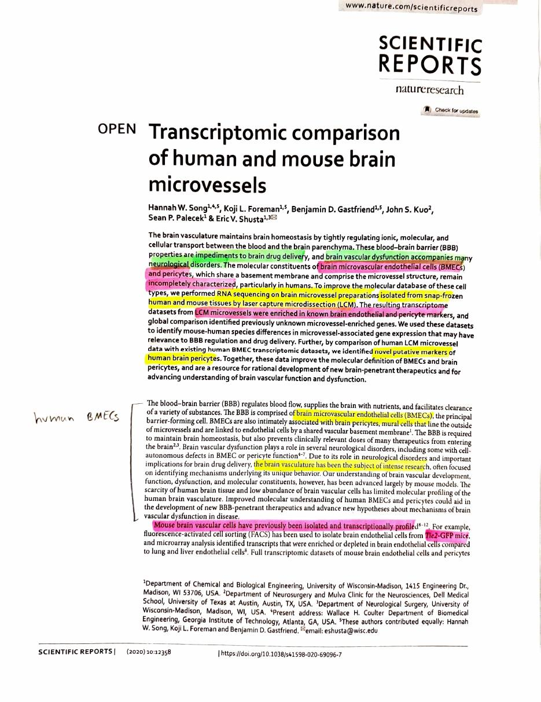
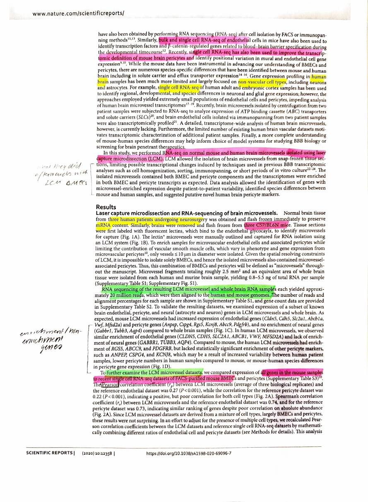
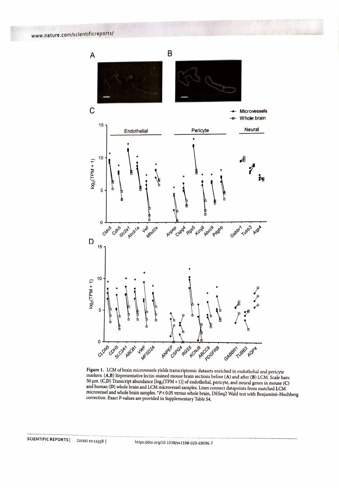
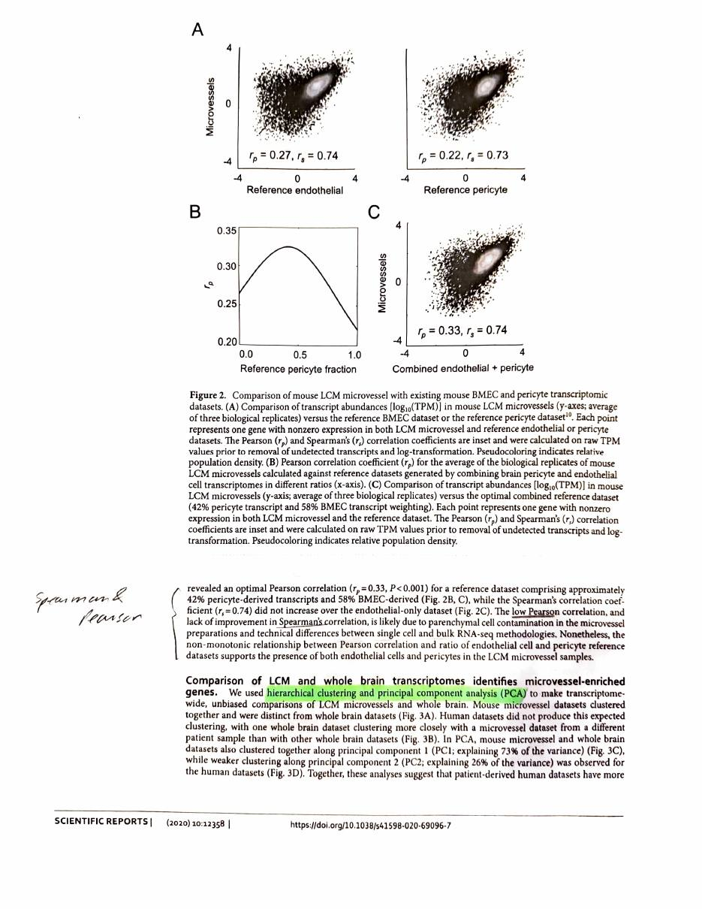
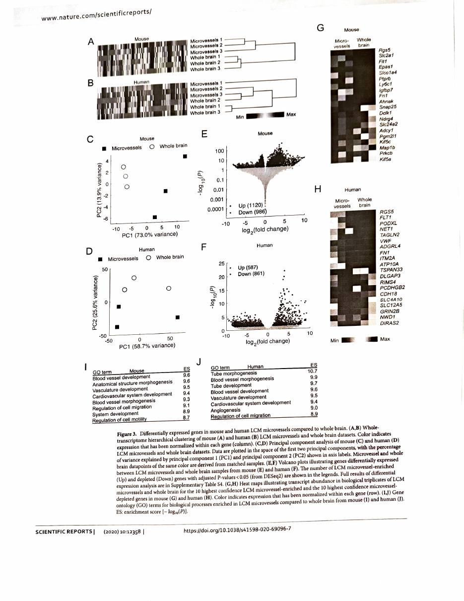
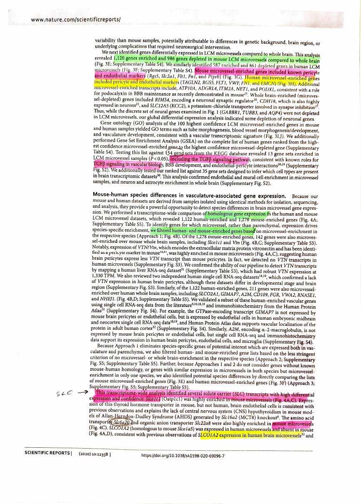
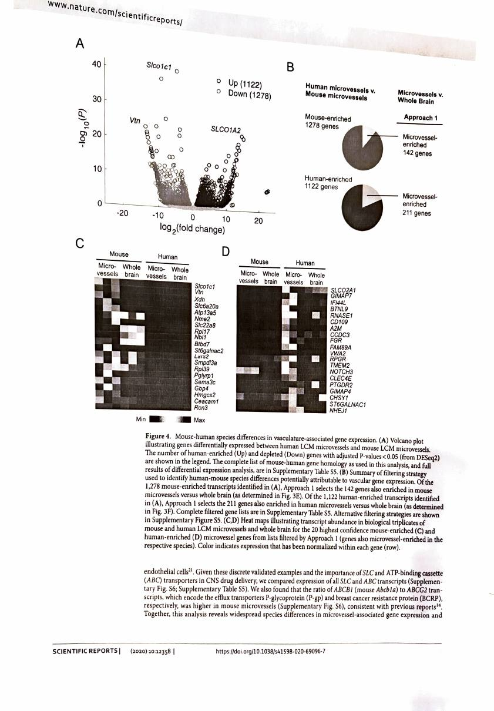
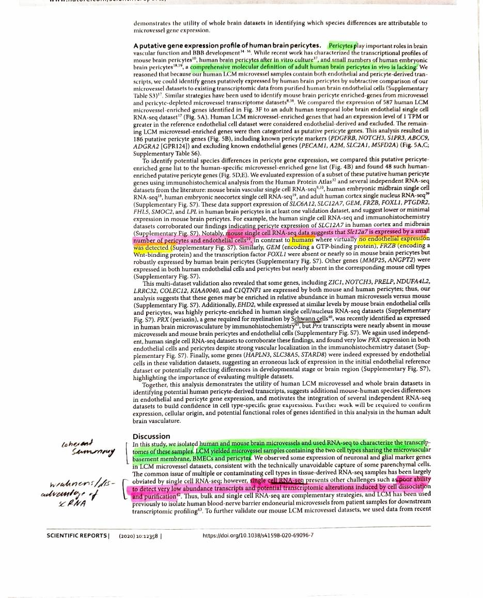
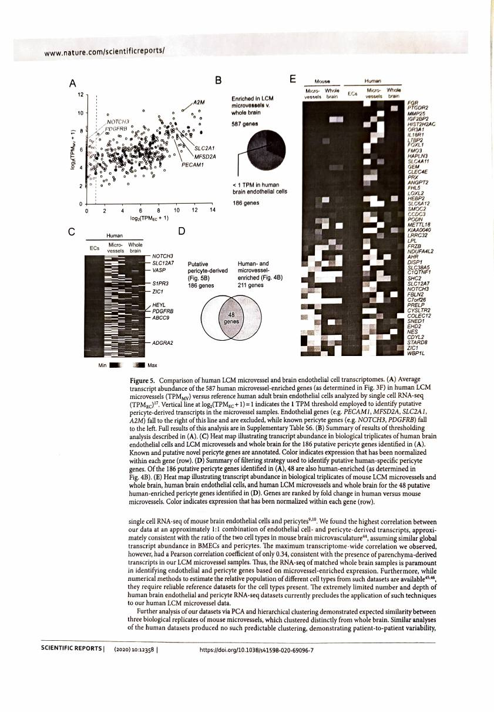
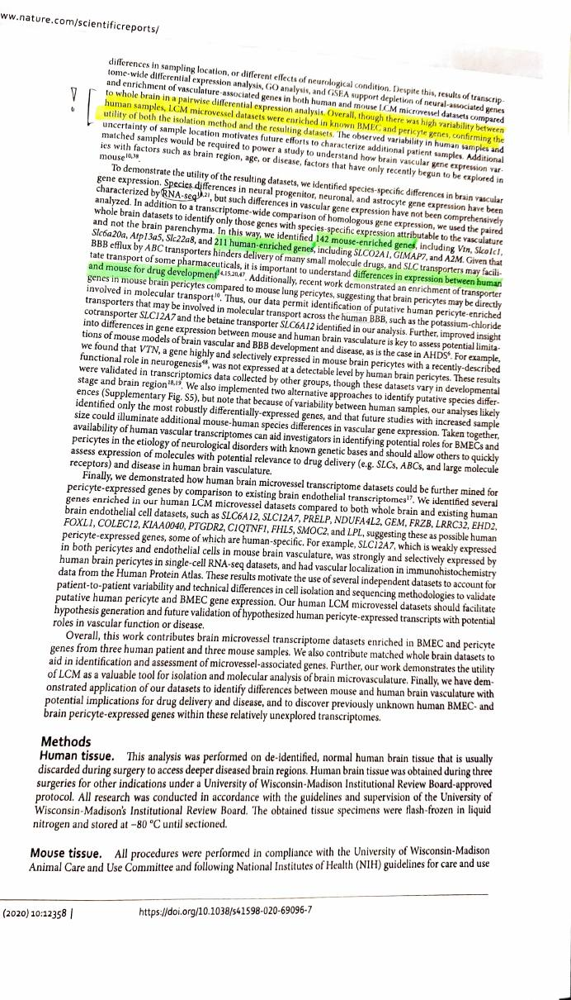

> Song HW, Foreman KL, Gastfriend BD, Kuo JS, Palecek SP, Shusta EV (2020). Transcriptomic
> comparison of human and mouse brain microvessels. *Scientific Reports* 10:12358.
> <https://doi.org/10.1038/s41598-020-69096-7>. Open access under CC BY 4.0.

| Field | |
|---|---|
| **Year** | 2020 |
| **Models** | **Human and mouse.** Three human neurosurgery patients and three C57BL/6N mice |
| **Brain region** | **Not controlled, and the paper says so.** Human tissue is normal brain removed during surgery to reach deeper diseased regions, so the region varies by patient. The paper lists sampling location as a possible source of the variability it sees |
| **Measures** | **RNA.** Bulk RNA-seq of laser-captured microvessels, about 20 million reads per sample from 0.8 to 5.5 ng of input RNA |
| **Method** | **Laser capture microdissection (LCM)** from snap-frozen tissue. Vessels stained with fluorescent lectin, outlined by hand and captured, limited to vessels 10 µm or less. The captured material is **endothelial cells and pericytes together**, which is why the paper says "microvessels" throughout rather than BMECs |
| **Cross-species stats** | Homologous gene mapping between species. **DESeq2** Wald test with **Benjamini-Hochberg** correction, adjusted *P* < 0.05. GO and KEGG gene set enrichment. Validated against published single-cell datasets and Human Protein Atlas immunohistochemistry |

: {tbl-colwidths="[22,78]"}

## My reading

The **SLC family**, the carrier proteins, appear quite often. So maybe we can highlight that,
the importance of the SLC carrier family, because it seems like a lot of people would want to
concentrate on that. Specifically **between species**, because it is vital for drug
development, which we did not do. In our first rough sketch of the project we did not focus on
any particular brain area. So maybe even adding these carrier proteins might be a good step.

They also compared different analysis models and techniques you can use, like single cell RNA
sequencing. It seems like the **LCM laser** they used was quite good at detecting even small
transcriptomic profiles, while RNA sequencing and single cell RNA sequencing were not able to
do so.

There are some expression markers that appear only in **human pericytes**, while they do
appear in human endothelial cells, and the other way around. Those appear too.

I did mark the paper, and I left out some parts because I thought they were not that important
to my overall understanding.

## The SLC and ABC transporters

Pulling this out because it is the part worth acting on.

The paper compares **all** SLC and ABC transcripts between the two species, and frames the
result as a drug development problem: efflux by ABC transporters hinders delivery of many
small molecule drugs, while SLC transporters can carry some pharmaceuticals in, so the
differences between human and mouse matter directly for whether a mouse result transfers.

**Mouse only, or much higher in mouse**

- `Slco1c1` (Oatp1c1), the thyroid hormone transporter, very highly enriched in mouse and not
  human. The paper links this to why mouse models of Allan-Herndon-Dudley Syndrome, made by
  knocking out `Slc16a2` (MCT8), lack the CNS hypothyroidism seen in human patients. **This is
  a concrete case of a species difference in one transporter breaking a disease model.**
- `Slc6a20a`, an amino acid transporter
- `Slc22a8`, an organic anion transporter

**Human only, or much higher in human**

- `SLCO1A2`, homologous to mouse `Slco1a5`, present in human microvessels and absent in mouse

**Ratio differences**

- The ratio of `ABCB1` to `ABCG2` (P-gp to BCRP) is higher in mouse microvessels than human

## Species-specific genes it names

**Mouse-enriched:** `Vtn` (vitronectin, a pericyte marker in mouse, with no transcripts
detected in human microvessels at all), `Slco1c1`, `Slc6a20a`, `Slc22a8`, `Atp13a5`, `Xdh`,
`Pglyrp1`.

**Human-enriched:** `SLCO2A1`, `GIMAP7`, `A2M`, `CD109`, `FGR`, `VWA2`, `RNASE1`, `NHEJ1`,
`BTNL9`.

**Putative human pericyte genes**, 186 identified and 48 of them human-enriched, validated
against single-cell data and immunohistochemistry: `SLC6A12`, `SLC12A7`, `GEM`, `FRZB`,
`FOXL1`, `PTGDR2`, `FHL5`, `SMOC2`, `LPL`. `GEM`, `FOXL1` and `FRZB` are absent or nearly
absent in mouse brain pericytes but robustly expressed in human.

## Checks against the paper

- **On LCM against single cell, the reasoning is worth having precisely.** The paper's argument
  is that single cell RNA-seq has a **poor ability to detect very low abundance transcripts**,
  and that the dissociation and purification needed to isolate single cells can itself alter
  the transcriptome. LCM cuts the vessel straight out of frozen tissue, so nothing is
  dissociated and low-abundance transcripts survive. The cost is that it cannot separate cell
  types: everything captured is endothelium and pericytes mixed. The paper calls the two
  approaches **complementary** rather than ranking one above the other.
- **The human data is noisier than the mouse data, and the paper is open about it.** Mouse
  microvessel replicates cluster cleanly away from whole brain. The human ones do not: one
  whole-brain sample clustered closer to a microvessel sample from a different patient. They
  attribute this to genetic background, brain region, and the conditions that required the
  surgery.
- **Pericyte enrichment was weaker in human.** Human microvessels showed less enrichment of
  `RGS5`, `ABCC9` and `PDGFRB`, and no significant enrichment of `ANPEP`, `CSPG4` or `KCNJ8`.
  The paper offers three possible reasons: patient variability, genuinely fewer pericytes in
  the human samples, or a real species difference in pericyte gene expression. It does not
  choose between them.
- **TGF beta signalling came out enriched** in microvessels in both species, by KEGG gene set
  enrichment. That is the same pathway
  [Kaufer and Friedman](../reading/sciam/barrier-against-brain-disease.qmd) build their
  albumin feedback loop on.

## How it relates to this project

1. **The SLC point is right, and it is stronger than it looks.** Two independent papers now
   report the same species differences in the same transporters. `Slco1c1` and `Slc22a8` are
   mouse-enriched in **both** Song and [Miao](miao2026.qmd); `A2M` is human-specific in both.
   That is replication across different tissue, different methods and six years. The SLC family
   is not incidentally divergent, it is reliably divergent.

2. **It supplies the mechanism the project's framing is missing.** `Slco1c1` differing between
   mouse and human is why an MCT8 knockout mouse fails to reproduce human Allan-Herndon-Dudley
   Syndrome. That is a worked example of a translational failure traced to one transporter, and
   it is exactly the kind of consequence the project's opening claim about the mouse to macaque
   to human pipeline is gesturing at without evidence.

3. **It sharpens the brain region gap.** The project never picked a region, and neither does
   this paper, but Song names region as a likely source of its human variability. Two papers
   now, this one and [O'Brown](obrown2018.qmd), point at region as an uncontrolled variable.
   That belongs in the [limitations](../results.qmd) alongside the canonical gene problem.

4. **Microvessel preparations are not endothelial preparations, and this project's list proves
   it.** LCM captures endothelium and pericytes together, and the paper is explicit about it.
   Checking Song's pericyte markers against the master gene list: **`PDGFRB`, `CSPG4`,
   `KCNJ8`, `ABCC9`, `NOTCH3` and `VTN` are all on it.** Those are pericyte genes sitting in a
   list the project describes as brain endothelial.

   This is the [`step1` defect](../audit.qmd) showing up from a second direction. Daneman S3,
   one of the three tables read in error, **is** the pericyte-specific list, and the audit
   noted it contains `Pdgfrb`, `Kcnj8`, `Vtn` and `Zic1`. Song independently confirms those are
   pericyte markers. So the contamination is not hypothetical and it is not small: fixing
   `step1` removes it, and until then any statement about "brain endothelial genes" here
   includes mural cells.

5. **Same lab as [Park 2019](park2019.qmd).** Palecek and Shusta are authors on both. Song is
   the descriptive groundwork; Park is the engineered model built on it.

## A possible direction

Focusing the project on the **SLC and ABC transporter families** rather than the whole
enrichment-derived list would fix several problems at once. The families are well defined, so
membership stops being a judgement call. They are the families the literature repeatedly
reports as species-divergent, so there is something to compare against. They are the families
that matter for drug delivery, which gives the conservation question a consequence. And the
gene list already carries 52 SLC and 9 ABC genes, so the data exists.

Recorded in [extensions](../extensions.qmd).

## Annotated scan

::: {.scan-note}
My own printed and annotated pages, scanned back in. Some
sections were left unmarked because they were not important to my overall understanding.
:::

```{=html}
<div class="scan-gallery">
  <figure>
    
    <figcaption>Page 1</figcaption>
  </figure>
  <figure>
    
    <figcaption>Page 2</figcaption>
  </figure>
  <figure>
    
    <figcaption>Page 3</figcaption>
  </figure>
  <figure>
    
    <figcaption>Page 4</figcaption>
  </figure>
  <figure>
    
    <figcaption>Page 5</figcaption>
  </figure>
  <figure>
    
    <figcaption>Page 6</figcaption>
  </figure>
  <figure>
    
    <figcaption>Page 7</figcaption>
  </figure>
  <figure>
    
    <figcaption>Page 8</figcaption>
  </figure>
  <figure>
    
    <figcaption>Page 9</figcaption>
  </figure>
  <figure>
    
    <figcaption>Page 10</figcaption>
  </figure>
</div>
```

::: {.scan-note}
Pages reproduced from Song et al. 2020, *Scientific Reports* 10:12358,
open access under CC BY 4.0. Handwriting and highlighting are mine.
[Original paper](https://doi.org/10.1038/s41598-020-69096-7).
:::
